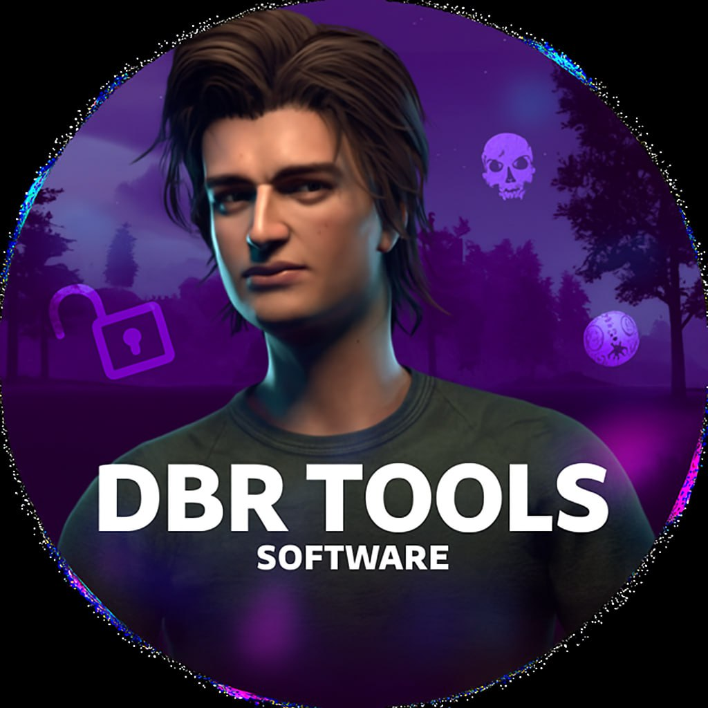

# DBR Tools
**Dead By Roblox** script v1.5I / v1.0L

  

If you load it while in lobby, it will load Lobby version. Loading ingame will load the main script.

# Loadstring
`loadstring(game:HttpGet("https://raw.githubusercontent.com/itzAkss/dbrtools/refs/heads/main/loader.lua"))()`
# Forced Load
`_G.lobbycheck = false`
`loadstring(game:HttpGet("https://raw.githubusercontent.com/itzAkss/dbrtools/refs/heads/main/loader.lua"))()`
